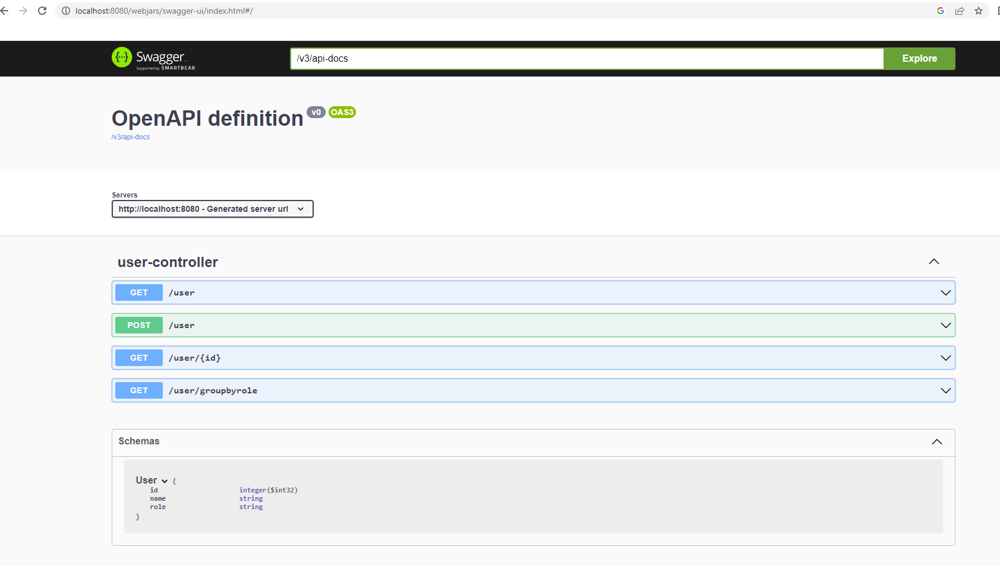

<h1>This project is an example of required configuration and demo code to use spring security with webflux.<h1>
<h3>Below are the important frameworks used.<h3> 
JDK: 17 
Springboot: 2.7.x 
SpringWebFlux: 2.7.x 
Springdoc-Openapi: 1.6.14 

<h4>The Springboot version at this time is 3.x.x but we do not have a compatible version of Springdoc-Openapi available at the moment.

Link: http://localhost:8080/webjars/swagger-ui/index.html
